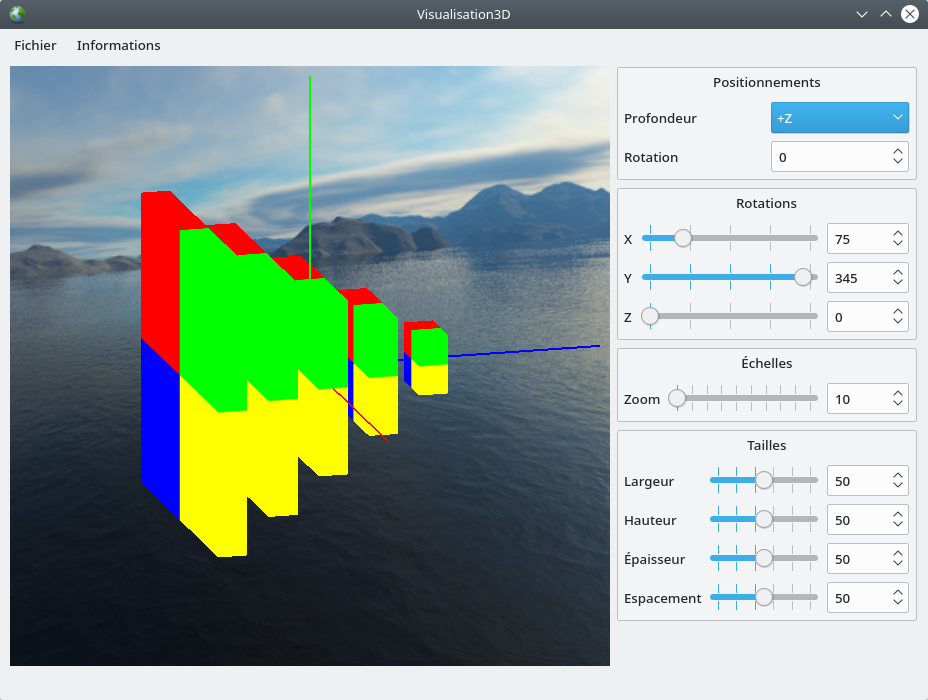

# Visualisation3D

Visualisation3D est une application graphique permettant la visualisation en trois dimensions d'images superposées.

Les fonctionnalités principales de l'application sont les suivantes :

 - Sélection par l'utilisateur d'un ensemble d'images,
 - Représentation en trois dimensions des images sélectionnées,
 - Fonctionnalités de positionnements, de rotations, d'échelles et de tailles.

Les fonctionnalités ultérieures de l'application seront les suivantes :

 - Fonctionnalités de coupes.

L'application est réalisée en C++20 et [Qt 5.15.2](https://download.qt.io/archive/qt/5.15/5.15.2/).

